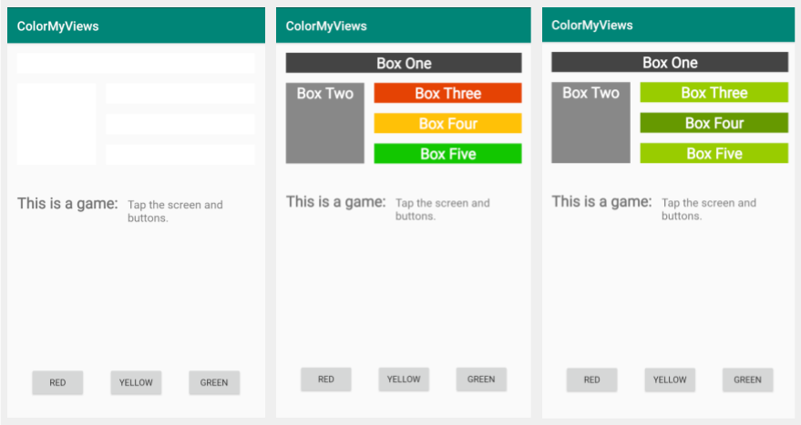

# Layouts - ColorMyViews app

This is the second toy app for lesson 2 of the [Android App Development in Kotlin course on Udacity](https://www.udacity.com/course/developing-android-apps-with-kotlin--ud9012).

## ColorMyViews

The ColorMyViews app is a demo game app that lets users click to color boxes and the background.

This app demonstrates the following views and techniques:
* Using the Layout Editor to create layout
* In the Layout Editor: Creating chains, aligning objects, using baseline alignment for labels

## Screenshots

[App from Android App Development in Kotlin course on Udacity](https://www.udacity.com/course/developing-android-apps-with-kotlin--ud9012).

